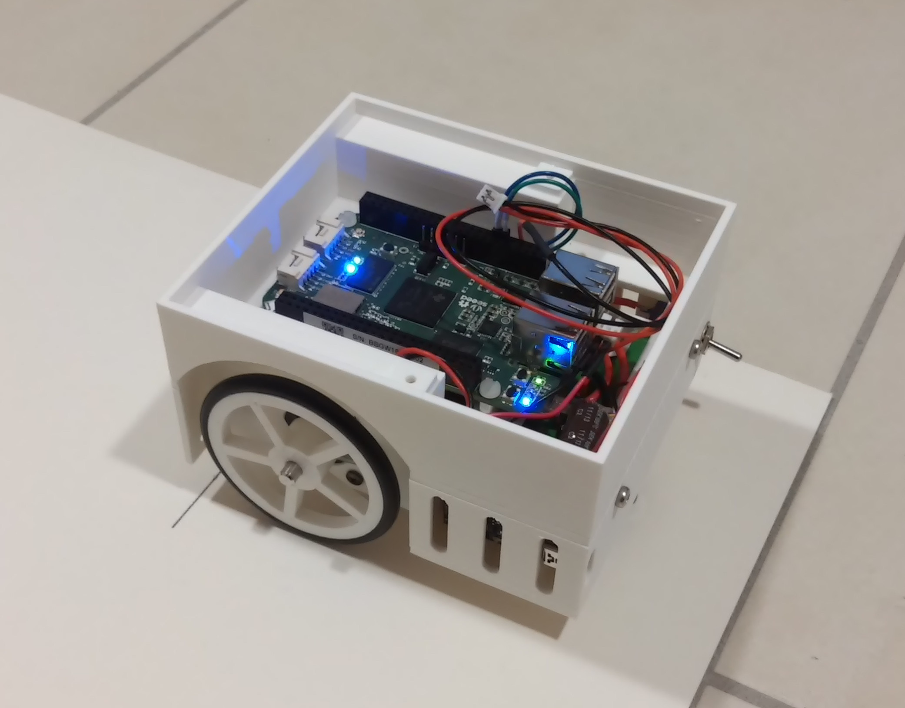

# StepperBotController
Two wheeled rover with stepper motors for precision movement. This is the control center of the project. The whole rover is 
"layered" in three slices:

- the chassis layer: https://github.com/Brezensalzer/StepperBotChassis
- the control layer: https://github.com/Brezensalzer/StepperBotController
- the sensor layer: https://github.com/Brezensalzer/StepperBotLidar2

The on-board SBC is a Beaglebone Green Wireless, it runs the mqRpcServer.py script. The script connects to a RabbitMQ Server on a Linux Machine and listens for incoming command messages.
On the Linux box a simple command line client mqRpcClient (nothing fancy, it's a proof of concept) is used to control the rover and to plot the LIDAR scans in map.

  

